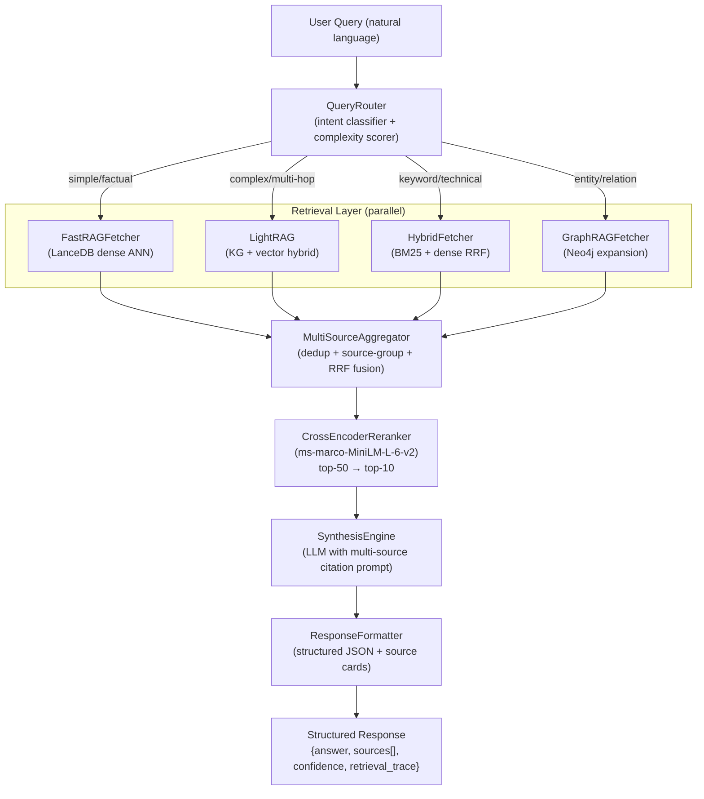

# Brain Module — Architecture & Design

## The Core Problem

You already have the retrieval plumbing built in `data_module/fetch/`:

- `FastRAGFetcher` → LanceDB dense ANN
- `GraphRAGFetcher` → Neo4j/NetworkX + graph expansion
- `HybridFetcher` → BM25 + dense (RRF)
- `AgenticFetcher` → multi-tool accumulator

What is missing is the **reasoning, synthesis, and multi-source presentation layer** — the "brain."

---

## Framework Choices

### Why LightRAG (not RAG-Anything)

RAG-Anything is built on top of LightRAG and is specifically designed for **parsing raw multimodal documents** (PDFs, Office files, images, equations). Your data is **already ingested and structured** — you don't need its parsing pipeline.

**LightRAG** gives you exactly what you need:

- Knowledge graph-augmented retrieval (local + global + naive + hybrid modes)
- Native Neo4j integration — plugs directly into your existing graph store
- Built-in RAGAS evaluation
- A REST API server with WebUI
- Supports Qwen3-30B, Ollama, OpenAI, and any OpenAI-compatible endpoint

### What else to add

| Component     | Tool                                                      | Why                                                                                                                                  |
| ------------- | --------------------------------------------------------- | ------------------------------------------------------------------------------------------------------------------------------------ |
| Orchestration | **LlamaIndex RouterQueryEngine**                          | Routes query to best retrieval strategy; has `SubQuestionQueryEngine` for multi-hop and `CitationQueryEngine` for source attribution |
| Re-ranking    | **cross-encoder/ms-marco-MiniLM-L-6-v2**                  | Takes top-50 candidates, re-ranks to top-5 before synthesis                                                                          |
| Synthesis LLM | **OpenAI GPT-4o or Qwen3-30B via Ollama**                 | Generates answer with multi-source citation prompt                                                                                   |
| Evaluation    | **Ragas**                                                 | Faithfulness, context precision, answer relevancy — integrated into LightRAG                                                         |
| Query Router  | **Custom classifier** (intfloat/e5-small-v2 + rule-based) | Routes to fast/hybrid/graph/lightrag fetcher                                                                                         |
| Caching       | **Redis / functools.lru_cache**                           | Cache embeddings and synthesis results                                                                                               |

### DSPy — worth mentioning

**DSPy** (Stanford) is worth considering if you want to auto-optimize your prompts and retrieval pipelines with labeled examples. It can learn the best way to combine sources. Not required for v1, but very powerful for v2.

---

## Architecture



---

## Structured Multi-Source Response Format

Every Q&A response is a typed `BrainResponse` object:

```python
@dataclass
class SourceCard:
    source_name: str        # "Stack Overflow", "Wikipedia", "HotpotQA" …
    excerpt: str            # The retrieved passage
    url: str                # Original attribution URL
    score: float            # Re-ranker score
    retrieval_method: str   # "dense", "graph", "bm25", "lightrag_hybrid"

@dataclass
class BrainResponse:
    question: str
    answer: str             # LLM-synthesized, with [1][2][3] inline citations
    sources: list[SourceCard]  # Ordered by relevance
    confidence: float       # Mean re-ranker score of used sources
    retrieval_trace: dict   # Which fetcher was used, latencies
    answer_type: str        # "factual", "multi-hop", "opinion", "unanswerable"
```

The LLM synthesis prompt forces inline citations:

```
Given these sources:
[1] Stack Overflow (score 0.94): "..."
[2] Wikipedia (score 0.87): "..."
[3] MS MARCO (score 0.81): "..."

Answer the question using ONLY these sources.
Cite each claim with [1], [2], [3].
If sources conflict, note the disagreement.
```

---

## Module Structure

```
brain_module/
├── pyproject.toml
├── brain_module/
│   ├── router/
│   │   ├── intent_classifier.py   # query type: factual/multi-hop/technical/unanswerable
│   │   └── complexity_scorer.py   # decides which fetchers to activate
│   ├── retrieval/
│   │   ├── lightrag_adapter.py    # bridges LightRAG server API ↔ data_module format
│   │   ├── fetcher_registry.py    # wraps all 4 existing fetchers + LightRAG
│   │   └── parallel_runner.py     # asyncio.gather across active fetchers
│   ├── aggregation/
│   │   ├── deduplicator.py        # hash + semantic dedup of retrieved passages
│   │   ├── source_grouper.py      # group by source_name for presentation
│   │   └── rrf_merger.py          # Reciprocal Rank Fusion across fetchers
│   ├── reranking/
│   │   └── cross_encoder.py       # cross-encoder/ms-marco-MiniLM-L-6-v2
│   ├── synthesis/
│   │   ├── prompt_builder.py      # builds multi-source citation prompt
│   │   ├── llm_client.py          # OpenAI / Ollama / LiteLLM factory
│   │   └── citation_parser.py     # extracts [1][2] references → source links
│   ├── response/
│   │   ├── schema.py              # BrainResponse, SourceCard dataclasses
│   │   └── formatter.py           # JSON + human-readable + markdown format
│   ├── evaluation/
│   │   └── ragas_eval.py          # Ragas faithfulness/context precision/answer relevancy
│   ├── cache/
│   │   └── query_cache.py         # Redis or lru_cache for query→response
│   └── api/
│       └── main.py                # FastAPI endpoints: /ask, /ask/stream, /health
```

---

## LightRAG Integration Strategy

LightRAG needs to be initialized with your existing Neo4j graph + a vector backend. Two options:

**Option A (Recommended): LightRAG as a parallel index**

- Run `lightrag-server` as a sidecar service
- Write a `LightRAGIngestionAdapter` that converts your `CanonicalQA` records → LightRAG's `insert()` format
- LightRAG builds its own KG + vector store internally (let it manage its own data)
- Query via LightRAG's REST API (`/query` with `mode: hybrid`)

**Option B: Connect LightRAG directly to your Neo4j**

- Pass `Neo4jStorage` config to LightRAG
- More complex setup, risks schema conflicts

Option A is cleaner — LightRAG manages its own state, you just call its API.

---

## Ingestion Adapter (data_module → LightRAG)

```python
# brain_module/retrieval/lightrag_adapter.py
async def ingest_canonical_qa(qa: CanonicalQA, lightrag_client: LightRAGClient):
    text = f"Q: {qa.title}\n\n{qa.body_markdown}\n\nBest Answer: {qa.answers[0].body_markdown}"
    await lightrag_client.insert(text, metadata={"source": qa.source.value, "url": qa.source_url})
```

---

## Key Technology Decisions

| Decision          | Recommendation                                                      | Reasoning                                                                  |
| ----------------- | ------------------------------------------------------------------- | -------------------------------------------------------------------------- |
| LLM for synthesis | GPT-4o or Qwen3-30B (Ollama)                                        | LightRAG recommends 32B+ for KG extraction; same model works for synthesis |
| Embedding model   | `BAAI/bge-m3` or keep `all-mpnet-base-v2`                           | bge-m3 is multilingual and top-performing                                  |
| Re-ranker         | `BAAI/bge-reranker-v2-m3` or `cross-encoder/ms-marco-MiniLM-L-6-v2` | bge-reranker-v2-m3 is newer and multilingual                               |
| Serving           | LightRAG server (FastAPI) + your own brain_module FastAPI           | Two services, one API gateway                                              |
| Evaluation        | Ragas (built into LightRAG)                                         | Free, comprehensive, no external service                                   |

---

## What RAG-Anything Offers (if you want it later)

If you later want to ingest **PDFs, research papers, or Office documents** into the knowledge base (e.g. adding arXiv papers or Stack Exchange meta posts), RAG-Anything adds:

- PDF/DOCX/PPTX parsing via MinerU
- Table/equation/image understanding via VLM
- Direct `insert_content_list()` API

It runs on top of LightRAG so switching later is a drop-in upgrade.

---

## Implementation Order

1. Set up LightRAG server with Neo4j backend, write ingestion adapter, populate with SQuAD + NQ first (smallest datasets)
2. Build `QueryRouter` + `ParallelRunner` wrapping existing fetchers + LightRAG API call
3. Build `CrossEncoderReranker` and `MultiSourceAggregator` with RRF
4. Build `SynthesisEngine` with citation prompt + `CitationParser`
5. Build `ResponseFormatter` + `BrainResponse` schema
6. Wire up FastAPI `/ask` endpoint
7. Add Ragas evaluation pipeline
8. Add Redis caching layer
