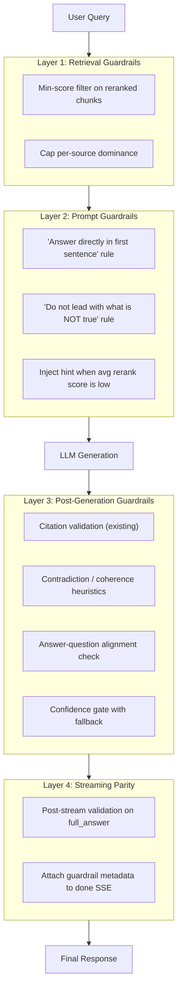

# LLM Response Guardrails Plan

## Problem Diagnosis

The "capital of Spain" example exposes several gaps working together:

1. **Noisy retrieval** -- chunks about Barcelona/Catalonia pass through with no minimum relevance cutoff, poisoning the LLM context
2. **Weak prompt framing** -- the system prompt ([`prompt_builder.py`](brain_module/brain_module/synthesis/prompt_builder.py) L13-24) says "cite every claim" and "note disagreement" but never says "answer the question directly first" -- so the model leads with tangential source material
3. **Zero post-generation checks** -- after the LLM responds, only citation index validation runs ([`citation_parser.py`](brain_module/brain_module/synthesis/citation_parser.py)); no contradiction detection, no relevance check, no coherence validation
4. **Streaming path is unguarded** -- [`main.py` /ask/stream](brain_module/brain_module/api/main.py) (L848-872) emits raw tokens with no post-stream validation at all

## Architecture: Four Guardrail Layers



---

## Layer 1: Retrieval-Level Guardrails

**File**: new module [`brain_module/brain_module/guardrails/retrieval_filter.py`](brain_module/brain_module/guardrails/retrieval_filter.py)
**Integration**: [`brain_module/brain_module/synthesis/__init__.py`](brain_module/brain_module/synthesis/__init__.py) L88 (before building source cards) and [`main.py`](brain_module/brain_module/api/main.py) streaming path L817

### 1a. Minimum reranker score threshold

After cross-encoder reranking, drop chunks below a configurable threshold (e.g. `MIN_RERANK_SCORE=0.15`). The cross-encoder outputs sigmoid-normalized scores in [0,1] -- chunks scoring below the threshold are tangentially related noise.

```python
def filter_low_relevance(
    chunks: list[dict],
    min_score: float = 0.15,
    min_keep: int = 1,
) -> list[dict]:
    """Drop chunks below min_score, but always keep at least min_keep."""
    above = [c for c in chunks if c.get("score", 0.0) >= min_score]
    if len(above) >= min_keep:
        return above
    return chunks[:min_keep]
```

### 1b. Source diversity cap

Prevent a single source domain from dominating all 4 synthesis slots. Cap at max 2 chunks from the same `source_name` to reduce echo-chamber retrieval about tangential topics (e.g. 3 chunks all about Barcelona).

---

## Layer 2: Prompt-Level Guardrails

**File**: [`brain_module/brain_module/synthesis/prompt_builder.py`](brain_module/brain_module/synthesis/prompt_builder.py) L13-24

### 2a. Strengthen the system prompt

Add three rules to `_SYSTEM_PROMPT`:

```
7. Answer the question DIRECTLY in your first sentence. Lead with the answer, then support it.
8. Do NOT start by stating what something is NOT. Always lead with the positive, correct answer.
9. If retrieved sources are mostly about a related but different topic, focus only on the parts that directly answer the question.
```

These directly address the "Barcelona is not the capital..." anti-pattern.

### 2b. Low-confidence context hint

When the average reranker score of the synthesis chunks is below a threshold (e.g. 0.3), inject a hint into the user message:

```
Note: The retrieved sources may have limited relevance to this question.
Only answer if you find a clear, direct answer in the sources.
```

This is passed via a new `confidence_hint` parameter to `build_synthesis_prompt`.

---

## Layer 3: Post-Generation Guardrails

**File**: new module [`brain_module/brain_module/guardrails/response_validator.py`](brain_module/brain_module/guardrails/response_validator.py)
**Integration**: [`brain_module/brain_module/synthesis/__init__.py`](brain_module/brain_module/synthesis/__init__.py) after L144 (after citation validation)

### 3a. Contradiction / negative-lead detection (heuristic)

Lightweight regex-based checks, no extra LLM call:

- **Negative-lead detector**: flag answers starting with "X is not", "No,", "That is incorrect" patterns when the question is a simple factual query (intent=factual)
- **Self-contradiction detector**: detect patterns like "A is not X... but A is X" or "X is Y... however X is not Y" within the same answer

```python
@dataclass
class ValidationResult:
    passed: bool
    issues: list[str]  # e.g. ["negative_lead", "self_contradiction"]
    suggested_action: str  # "pass" | "rewrite_prompt" | "fallback"
```

### 3b. Answer-question alignment check (lightweight)

For factual intent queries: check that the answer's first sentence contains at least one key entity from the question. E.g., question "capital of Spain" -- first sentence should mention "Spain" and ideally "Madrid" or "capital". This is a simple keyword overlap check, not an LLM call.

### 3c. Confidence gate

Combine reranker confidence + guardrail check results into a final confidence signal:

- If avg reranker score < 0.15 AND guardrail flags issues: append a disclaimer to the answer: "Note: This answer is based on limited source material and may not be fully accurate."
- If avg reranker score < 0.10 and no direct answer found: replace with "I cannot confidently answer this based on the available sources."

### 3d. Optional LLM-as-judge (configurable, off by default)

For high-stakes deployments, an opt-in second LLM call with a short judge prompt:

```
Given the question and answer below, does the answer directly and correctly
address the question without contradiction? Reply YES or NO with a one-line reason.
```

Gated behind env var `ENABLE_LLM_JUDGE=false` to avoid latency/cost by default. If NO, trigger a single retry with a tightened prompt.

---

## Layer 4: Streaming Path Parity

**File**: [`brain_module/brain_module/api/main.py`](brain_module/brain_module/api/main.py) L848-872

The `/ask/stream` endpoint currently emits raw tokens with zero post-processing. After the stream completes (`full_answer` is assembled at L853), add:

1. Run `validate_citations(full_answer, source_cards_objects)` -- same as non-streaming path
2. Run the Layer 3 heuristic checks on `full_answer`
3. Attach results to the `done` SSE event:

```python
yield _sse({
    "type": "done",
    "answer": cleaned_answer,  # citation-validated
    "guardrail_flags": validation_result.issues,  # e.g. ["negative_lead"]
    "confidence": ...,
    ...
})
```

The frontend can use `guardrail_flags` to show a disclaimer or highlight low-confidence answers.

---

## File Changes Summary

| File                                                                               | Change                                                                                                              |
| ---------------------------------------------------------------------------------- | ------------------------------------------------------------------------------------------------------------------- |
| New: `brain_module/brain_module/guardrails/__init__.py`                            | Package init                                                                                                        |
| New: `brain_module/brain_module/guardrails/retrieval_filter.py`                    | Min-score filter, source diversity cap                                                                              |
| New: `brain_module/brain_module/guardrails/response_validator.py`                  | Contradiction detection, alignment check, confidence gate                                                           |
| New: `brain_module/brain_module/guardrails/llm_judge.py`                           | Optional LLM-as-judge (off by default)                                                                              |
| Edit: [`prompt_builder.py`](brain_module/brain_module/synthesis/prompt_builder.py) | Add rules 7-9 to system prompt, add `confidence_hint` param                                                         |
| Edit: [`synthesis/__init__.py`](brain_module/brain_module/synthesis/__init__.py)   | Integrate retrieval filter before source cards, run response validator after citation check                         |
| Edit: [`main.py`](brain_module/brain_module/api/main.py)                           | Add retrieval filter + post-stream validation to `/ask/stream`; add env vars `MIN_RERANK_SCORE`, `ENABLE_LLM_JUDGE` |
| Edit: [`schema.py`](brain_module/brain_module/response/schema.py)                  | Add `guardrail_flags: list[str]` to `BrainResponse`                                                                 |

---

## Configuration (env vars)

- `MIN_RERANK_SCORE` -- minimum cross-encoder score to keep a chunk (default: `0.15`)
- `MAX_SAME_SOURCE` -- max chunks from one source in synthesis (default: `2`)
- `LOW_CONFIDENCE_THRESHOLD` -- avg score below which to inject prompt hint (default: `0.3`)
- `ENABLE_LLM_JUDGE` -- enable optional second-pass LLM judge (default: `false`)
- `GUARDRAIL_STRICT_MODE` -- if true, block responses that fail validation instead of disclaiming (default: `false`)

---

## How This Fixes the "Capital of Spain" Case

1. **Layer 1**: Barcelona-focused chunks likely score lower on cross-encoder for "capital of Spain" -- filtered out or capped
2. **Layer 2**: Prompt rule "answer directly in first sentence" prevents "Barcelona is not..." framing
3. **Layer 3**: Negative-lead detector flags the response; answer-question alignment check catches that first sentence doesn't contain "Madrid"
4. **Layer 4**: Streaming users also get guardrail metadata
