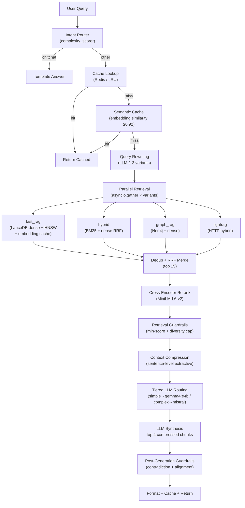

# RAG Production Optimization -- Gap Analysis

## Current Architecture (as-built)



---

## Scorecard: What You Have vs What's Recommended

### 1. Hybrid Retrieval -- PARTIALLY DONE

**What you have:**

- 4 fetcher strategies: `fast_rag` (dense), `hybrid` (BM25+dense), `graph_rag`, `lightrag`
- BM25 via `rank_bm25` in [data_module/fetch/hybrid.py](data_module/data_module/fetch/hybrid.py)
- RRF fusion in [brain_module/aggregation/rrf_merger.py](brain_module/brain_module/aggregation/rrf_merger.py)

**What's missing:**

- **BM25 is off by default** -- `HYBRID_BM25_EAGER_LOAD` defaults to `false`, so `HybridFetcher` degrades to dense-only unless explicitly enabled
- **RRF weight key mismatch** -- Router assigns weight to key `lightrag`, but `LightRAGFetcher` tags chunks as `lightrag_hybrid`; `rrf_merger.py` defaults missing keys to 1.0, so the routing weight is silently ignored
- No ElasticSearch / Qdrant hybrid -- relying on in-process `rank_bm25` which doesn't scale

### 2. Top-K Settings -- TOO HIGH

**Current defaults:**

- `top_k = 10` (API default), expansion factor `2x` -> 20 chunks fetched per fetcher
- `TOP_N_BEFORE_RERANK = 20`
- `top_k_for_synthesis = 8`

**Recommended:** `top_k = 3-8`, retrieve `~15`, rerank to `3-5`, synthesize from `3-5`

**Gap:** You're passing **8 chunks** into the LLM prompt. The guide recommends 3-5. The retrieval fan-out (20 per fetcher x 4 fetchers = up to 80 chunks before dedup) is excessive.

### 3. Reranking -- DONE (with a bug)

**What you have:**

- Cross-encoder `ms-marco-MiniLM-L6-v2` in [reranking/cross_encoder.py](brain_module/brain_module/reranking/cross_encoder.py)
- Sigmoid normalization, bypass for low-complexity factual queries

**What's missing:**

- Bypass logic only applies to `/ask`, not `/ask/stream` (inconsistent behavior)
- No ColBERT / BGE-reranker option (MiniLM-L6 is the smallest; `bge-reranker-v2-m3` or `colbert-v2` would be more accurate)

### 4. Multi-Stage Models -- NOT IMPLEMENTED

**Current:** Single LLM call (`gpt-4o` or `qwen3:30b`) for the full answer.

**Recommended architecture:**

| Stage            | Model                    | Purpose     |
| ---------------- | ------------------------ | ----------- |
| Retrieval        | embeddings               | Done        |
| Rerank           | small transformer        | Done        |
| **Draft answer** | **small LLM (7-8B)**     | **MISSING** |
| **Final polish** | **large LLM (optional)** | **MISSING** |

This is a significant latency/cost optimization -- a fast 8B model drafts, and only complex queries go to a larger model.

### 5. Context Compression -- NOT IMPLEMENTED

**Current:** Truncation to 600 characters in [synthesis/prompt_builder.py](brain_module/brain_module/synthesis/prompt_builder.py). That's it.

**Missing:**

- **Sentence extraction** -- extract only query-relevant sentences from chunks
- **Token filtering** -- remove boilerplate/headers
- **Query-focused compression** -- LLM or extractive model picks relevant spans
- This is called out as a "HUGE WIN" in the guide

### 6. Parallelism -- PARTIALLY DONE

**What you have:**

- Retrieval is parallelized via `asyncio.gather` in [retrieval/parallel_runner.py](brain_module/brain_module/retrieval/parallel_runner.py)
- 12-second timeout per fetcher

**What's missing:**

- **Synthesis is fully sequential** -- single LLM call, no parallel draft
- **No parallel query variants** (see Query Rewriting below)
- Reranking is sequential (could batch GPU inference)

### 7. Query Rewriting -- NOT IMPLEMENTED

**This is completely absent.** The raw user query goes directly to all fetchers unchanged.

**Missing features:**

- Expand ambiguous queries ("Who won it?" -> "Who won the FIFA World Cup 2022?")
- Generate multiple query variants for parallel retrieval
- HyDE (Hypothetical Document Embeddings)
- This "massively improves retrieval quality" per the guide

### 8. Caching -- PARTIALLY DONE

**What you have:**

- Full response cache (Redis or in-memory LRU, 24h TTL) in [cache/query_cache.py](brain_module/brain_module/cache/query_cache.py)
- SHA256-normalized query key

**What's missing:**

- **No embedding cache** -- same query embeds repeatedly
- **No chunk-to-summary cache** -- if the same chunks appear in different queries, summaries are regenerated
- **No partial/semantic cache** -- only exact (normalized) query matches hit cache; paraphrased queries miss entirely
- **No cache warming** for common queries

### 9. Streaming Responses -- FAKE STREAMING

**Current:** `/ask/stream` in [api/main.py](brain_module/brain_module/api/main.py) runs the **full** LLM completion, then splits the finished text on spaces and emits pseudo-tokens via SSE. The frontend ([App.tsx](frontend/src/App.tsx)) doesn't even use SSE -- it does a plain `fetch` POST and waits for JSON.

**What's needed:**

- True token-level SSE from the LLM (OpenAI and Ollama both support `stream: true`)
- Frontend `EventSource` or `ReadableStream` reader to render tokens incrementally
- Users perceive massive speed improvement even if total latency is the same

### 10. Graph RAG Optimization -- MOSTLY DONE (Neo4j migrated)

**What you have:**

- Neo4j graph backend (production), NetworkX kept as dev fallback
- `GraphRAGFetcher` is store-agnostic via `AbstractStore` interface
- `Neo4jGraphStore` with Cypher-based `get_subgraph()` (depth 1-3) and `neighbors()` (limit 200)
- Startup is instant (no pickle load), subgraph queries ~280ms, neighbor lookups ~85ms

**What's missing:**

- **No precomputed graph neighborhoods** -- Cypher traversal still happens at query time
- **No cached node summaries** -- graph entities are re-processed each query
- Could add Neo4j APOC periodic precompute job for hot entities

---

## Additional Gaps Not in the Checklist

### 11. Vector Index Type -- IVF-PQ, not HNSW

LanceDB is configured with **IVF-PQ** (256 partitions, 96 sub-vectors) in [storage/lance_store.py](data_module/data_module/storage/lance_store.py). The guide recommends **FAISS with HNSW** for speed. FAISS is in `requirements.txt` but **never used for serving** -- only LanceDB is wired into fetchers.

### 12. Model Serving / Quantization -- NOT OPTIMIZED

- Using **Ollama** for local inference (`qwen3:30b`). No evidence of:
  - vLLM or TGI for high-throughput batched inference
  - Explicit GGUF / 4-bit quantization config
  - GPU memory management / KV cache optimization
- Ollama is convenient but not production-grade for latency-sensitive serving

### 13. Observability -- DATA ONLY, NO REQUEST METRICS

The [observability/dashboard.py](observability/dashboard.py) Streamlit app tracks **data pipeline state** (row counts, ingest durations, index sizes) but has **zero** request-level metrics:

- No P50/P95/P99 latency tracking
- No per-stage latency breakdown (retrieval vs rerank vs synthesis)
- No token throughput or cost tracking
- No error rate monitoring
- The brain module logs timing to console but nothing is collected

### 14. Unused Configuration

- `chunk_overlap_tokens: 64` in [config/pipeline.yaml](data_module/config/pipeline.yaml) is declared but **never read** by any code
- Embedding model is `all-MiniLM-L6-v2` (384-dim) -- on the small side; `all-mpnet-base-v2` (768-dim) or `e5-large` would improve retrieval quality at the cost of index size

### 15. Prompt Efficiency

- System prompt in `prompt_builder.py` includes verbose citation rules in every call
- No prompt caching (OpenAI supports this; saves ~50% on repeated system prompts)
- `max_synthesis_tokens=1024` and `temperature=0.2` are hardcoded, not configurable per-request

---

## Priority-Ordered Action Items

### Tier 1 -- Highest Impact, Lowest Effort

1. **Enable BM25 by default** (`HYBRID_BM25_EAGER_LOAD=true`) and fix the RRF weight key mismatch (`lightrag` vs `lightrag_hybrid`)
2. **Reduce top_k defaults**: API `top_k=5`, `RETRIEVAL_EXPANSION_FACTOR=1.5`, `top_k_for_synthesis=4`
3. **Implement true SSE streaming**: Wire Ollama/OpenAI `stream: true` through synthesis, emit real tokens in `/ask/stream`, update frontend to consume `EventSource`
4. **Add request-level latency metrics** to the observability dashboard (per-stage timing already exists in trace metadata)

### Tier 2 -- High Impact, Moderate Effort

5. **Query rewriting module**: Use a fast model (or the same LLM with a short prompt) to expand/clarify the query before retrieval; generate 2-3 variants for parallel fetch
6. **Context compression**: After reranking, extract only query-relevant sentences (extractive, no LLM needed -- use sentence-transformers similarity) before passing to synthesis
7. **Embedding cache**: Redis hash or local LRU keyed by (query_text, model_name) -> vector; avoids re-encoding identical queries
8. **Upgrade vector index**: Switch LanceDB to HNSW mode (LanceDB supports it), or add FAISS HNSW as the primary ANN backend

### Tier 3 -- Production Hardening

9. **Multi-stage LLM**: Route simple queries to a fast 8B model, only use the large model for complex/multi-hop
10. **vLLM or TGI** for local model serving instead of Ollama (2-4x throughput improvement)
11. **Graph precomputation**: Precompute and cache k-hop neighborhoods and entity summaries in Neo4j at ingest time
12. **Semantic caching**: Use embedding similarity on the query to match "close enough" cached responses (not just exact match)
13. **Prompt caching**: Use OpenAI's prompt caching for the system prompt, or cache compiled prompts locally
14. **Production-grade BM25**: Replace `rank_bm25` with ElasticSearch or Tantivy for scalable keyword search

---

## Completed: Neo4j Graph Backend Migration

**Problem**: 1.1GB NetworkX pickle took 90+ seconds to load at startup, consuming 5-10 GB RAM.

**Solution**: Migrated graph store from NetworkX to Neo4j.

**Changes made**:

- `data_module/config/storage.yaml` -- switched `backend: neo4j`, uncommented Neo4j settings
- `brain_module/brain_module/api/main.py` -- uses `get_graph_store()` factory with env-driven backend selection (`GRAPH_BACKEND=neo4j`)
- `data_module/data_module/storage/graph_store.py` -- fixed `Neo4jGraphStore.get_subgraph()` to properly extract entities AND triples; added `neighbors()` method
- `brain_module/.env` -- added `GRAPH_BACKEND`, `NEO4J_URI`, `NEO4J_USER`, `NEO4J_PASSWORD`
- `start_services.sh` -- added Neo4j as service #1 in startup sequence

**Result**: Startup is instant (no graph pickle load), subgraph queries take ~280ms, neighbor lookups ~85ms.

**Full graph export** from pickle to Neo4j is a one-time background job (~1-2h).

---

## Future Option: SQLite Adjacency Tables

If Neo4j is too heavyweight for a given deployment (e.g. single-machine, no Java):

1. Store nodes in `graph_nodes(entity_id PK, entity_type, label, ...)`
2. Store edges in `graph_edges(triple_id PK, subject_id FK, object_id FK, predicate, ...)`
3. Create indexes on `entity_id`, `subject_id`, `object_id`
4. Multi-hop via recursive CTEs: `WITH RECURSIVE neighbors AS (...)`
5. Implement as `SQLiteGraphStore(AbstractStore)` in `graph_store.py`
6. Trade-off: slower than Neo4j for deep traversals, but zero infrastructure

---

## Completed: Tier 2 Optimisations (Query Rewriting, Context Compression, Embedding Cache)

### Query Rewriting / Expansion

**Problem**: Raw user queries went directly to fetchers unchanged — ambiguous or short queries yielded poor retrieval.

**Solution**: New `brain_module/brain_module/query/rewriter.py` with `QueryRewriter` class.

**How it works**:
- Uses a fast LLM call (128 max tokens, temperature=0.7) with a short system prompt to generate 2 alternative query phrasings
- Original query is always variant #1 (retrieval quality never degrades)
- All variants are fetched in parallel via `asyncio.gather` over the existing `ParallelFetcher`
- Results from all variants merge into the same RRF aggregation pipeline

**Integration**: `_run_pipeline` (step 3) and `/ask/stream` (step 2) both call `query_rewriter.rewrite()` before parallel fetch.

**Config**: `QUERY_REWRITE_ENABLED=true`, `QUERY_REWRITE_MAX_VARIANTS=3`

### Context Compression

**Problem**: Full chunk text (up to 600 chars) was fed to the LLM, including irrelevant sentences that added noise and cost.

**Solution**: New `brain_module/brain_module/compression/sentence_compressor.py` with `SentenceCompressor` class.

**How it works**:
- Splits each reranked chunk into sentences
- Computes cosine similarity between each sentence and the query using sentence-transformers
- Keeps only top-N sentences per chunk (default 5) that score above a minimum similarity threshold (default 0.25)
- Preserves original sentence order within each chunk
- Purely extractive — no LLM call required

**Integration**: Runs inside `SynthesisEngine.synthesise()` after retrieval guardrails (Layer 1) and in `/ask/stream` before building source cards.

**Config**: `CONTEXT_COMPRESSION_ENABLED=true`, `CONTEXT_COMPRESSION_MIN_SCORE=0.25`, `CONTEXT_COMPRESSION_TOP_SENTS=5`

### Embedding Cache

**Problem**: `FastRAGFetcher` called `self._embedder.encode([query])` on every request, even for repeated queries.

**Solution**: New `brain_module/brain_module/cache/embedding_cache.py` with `EmbeddingCache` class.

**How it works**:
- LRU cache (OrderedDict) keyed by normalised query text, values are numpy vectors
- Wraps any embedder's `encode()` method — mixed batch hits/misses handled correctly
- Tracks hit/miss statistics via `.stats` property
- Cache is process-local (no Redis needed for embeddings — vectors are small)

**Integration**: `_register_data_module_fetchers` wraps `fast_rag._embedder` with `EmbeddingCache` at startup.

**Config**: `EMBEDDING_CACHE_ENABLED=true`, `EMBEDDING_CACHE_MAXSIZE=2048`

---

## Completed: Tier 3 Optimisations (HNSW Index, Tiered LLM, Semantic Cache)

### HNSW Index Support

**Problem**: LanceDB was using IVF-PQ index (256 partitions, 96 sub-vectors). HNSW provides faster ANN search with better recall at the cost of a larger index.

**Solution**: Extended `LanceStore.create_index()` in `data_module/data_module/storage/lance_store.py`.

**How it works**:
- `create_index()` now accepts `index_type="IVF_PQ"` (default) or `"HNSW_SQ"`
- HNSW-SQ uses m=16, ef_construction=150 via LanceDB's native `HnswSq` class
- Falls back to IVF-PQ automatically if HNSW creation fails
- Search path is unchanged (LanceDB handles index type transparently)

**Config**: Pass `index_type="HNSW_SQ"` to `create_index()` after bulk load.

### Tiered LLM Routing

**Problem**: Single LLM model (mistral/gpt-4o) used for all queries regardless of complexity. Simple factual queries don't need a large model.

**Solution**: New `TieredLLMClient` class in `brain_module/brain_module/synthesis/llm_client.py`.

**How it works**:
- Wraps two LLM clients: `fast_client` and `large_client`
- `set_complexity(score)` is called before each pipeline run with the router's complexity score
- Queries below threshold (default 0.35) route to the fast model; complex queries route to the large model
- If `LLM_MODEL_FAST` is not set, degrades gracefully to single-model operation
- `create_tiered_llm_client()` factory handles the decision automatically

**Integration**: `main.py` lifespan uses `create_tiered_llm_client()`. Pipeline calls `set_complexity(plan.complexity_score)` before synthesis in both `/ask` and `/ask/stream`.

**Config**: `LLM_MODEL_FAST=gemma4:e4b`, `LLM_TIERED_THRESHOLD=0.35`

**Verified**:
- Simple factual ("What is a knowledge graph?") → complexity=0.12 → **gemma4:e4b**
- Complex multi-hop (compare/contrast knowledge graphs vs vector DBs) → complexity=0.45 → **mistral**

### Semantic Cache

**Problem**: Exact-match cache (SHA256 of normalised text) only hits on identical queries. Paraphrased queries ("What is X?" vs "How does X work?") always miss.

**Solution**: New `brain_module/brain_module/cache/semantic_cache.py` with `SemanticCache` class.

**How it works**:
- Stores (query_embedding, response_json) pairs in an in-process list
- On lookup, embeds the incoming query and does brute-force cosine scan against all stored embeddings
- Returns the best match if cosine similarity >= threshold (default 0.92)
- Bounded by maxsize (default 1024); evicts oldest entries on overflow
- Cache lookup is ~8ms even at max capacity (brute-force over 1024 × 384-dim vectors)

**Verified**: "How does retrieval augmented generation work?" hit semantic cache for "What is retrieval augmented generation?" (sim=0.964 > 0.92 threshold), returning in 8ms vs 17s full pipeline.

**Integration**: In `_run_pipeline`, checked after exact-match cache miss. Results stored in both exact and semantic caches.

**Config**: `SEMANTIC_CACHE_ENABLED=true`, `SEMANTIC_CACHE_THRESHOLD=0.92`, `SEMANTIC_CACHE_MAXSIZE=1024`

---

## Completed: vLLM / TGI Model Serving Support

### vLLM & TGI Backends

**Problem**: Ollama is convenient for development but not optimized for production throughput. vLLM provides continuous batching, PagedAttention, and speculative decoding. TGI provides flash-attention and quantization.

**Solution**: Added `VLLMClient` and `TGIClient` to `brain_module/brain_module/synthesis/llm_client.py`.

**How it works**:
- Both vLLM and TGI expose OpenAI-compatible APIs (`/v1/chat/completions`)
- `VLLMClient` and `TGIClient` extend `OpenAIClient` with correct default `base_url` values
- Factory function `create_llm_client()` now accepts `"vllm"` and `"tgi"` backends
- Works with tiered routing — can mix backends (e.g. fast=ollama/gemma4:e4b, large=vllm/mistral-7b)

**Config**:
```
# vLLM
LLM_BACKEND=vllm
LLM_MODEL=mistralai/Mistral-7B-Instruct-v0.3
VLLM_BASE_URL=http://localhost:8000/v1

# TGI
LLM_BACKEND=tgi
LLM_MODEL=tgi
TGI_BASE_URL=http://localhost:8080/v1
```

**Verified**: Factory correctly creates `VLLMClient` / `TGIClient` with proper base URLs. Supports custom URLs for remote GPU servers.

### Deferred: Graph Neighborhood Precompute

Moved to separate plan: `neo4j_periodic_ingest_pipeline.plan.md`. This is a data pipeline task requiring periodic scheduling, incremental ingest, and Neo4j APOC jobs — not a brain module code change.
