# Final Consolidated RAG Optimization Plan

## Objective
Reduce end-to-end latency while improving answer reliability under limited/static data.  
This final plan combines your PDF strategy and the earlier pipeline-level plan into one prioritized execution roadmap.

## Outcomes We Optimize For
- Lower P95 latency for `/ask` and `/generate-answer`.
- Fewer wrong-context answers (less contamination from weak nodes/chunks).
- Better recall behavior under data limits, without blindly increasing corpus size.

## Baseline and Acceptance Criteria
- Baseline stage timings using `latency_breakdown_ms` (`routing`, `query_rewrite`, `parallel_fetch`, `aggregate`, `rerank`, `synthesis`, `total`).
- Baseline quality on fixed query set:
  - citation validity
  - abstain correctness (when evidence is weak)
  - confidence distribution
- Acceptance:
  - P95 latency reduction target (30-50% first pass).
  - No significant drop in grounding/citation quality.
  - Reduced rate of low-confidence-yet-confident answers.

## Phase 1: Adaptive Pipeline (Fast Path vs Deep Path) [Highest Priority]
Current stack is max-quality-by-default; switch to adaptive execution.

1. Introduce two execution modes:
   - **Fast path** (simple/factual): no rewrite or max 1 variant, FastRAG only, no cross-encoder rerank, minimal synthesis budget.
   - **Deep path** (complex/multi-hop): rewrite + multi-fetcher + rerank + guarded compression + full synthesis.
2. Add early-stop retrieval:
   - If first-pass retrieval confidence is high, skip additional fetchers and expensive rerank/compression.
3. Tighten runtime knobs:
   - `QUERY_REWRITE_MAX_VARIANTS` to 2 max.
   - Lower `RETRIEVAL_EXPANSION_FACTOR`.
   - Lower `TOP_N_BEFORE_RERANK`.
   - Lower synthesis context budget and token budget for fast path.

## Phase 2: Encoder Latency Reduction [Critical]
1. Move embeddings off CPU where available (`mps`/`cuda`) and keep CPU fallback.
2. Add request-scoped embedding reuse to avoid duplicated query embedding work.
3. Gate or disable sentence-level compression for low-context/simple queries.
4. Add hard cap on total sentences scored by compressor.
5. Keep rewrite disabled/limited on short factual queries.

## Phase 3: Retrieval Trust Control (Wrong Node Contamination) [Critical]
1. Enforce stricter pre-synthesis relevance threshold; drop low-confidence chunks.
2. Add cross-source agreement check:
   - Prefer facts supported by multiple chunks/sources.
   - Downweight singleton claims in low-confidence settings.
3. Strengthen source diversity cap to prevent one noisy source dominating.
4. Add explicit abstain mode:
   - If context confidence is low/conflicting, return "not enough information".
5. Keep synthesis prompt strict:
   - answer only from provided sources
   - express uncertainty on conflict
   - abstain when insufficient evidence

## Phase 4: Data Hunger Strategy (Targeted Recall, Not Blind Scale)
1. Use query-aware retrieval strategy:
   - route by intent/domain to most relevant source mix.
2. Add on-demand retrieval fallback for low-confidence queries:
   - web/API/domain connectors (phase-gated).
3. Improve chunking quality in indexing:
   - evaluate semantic/hierarchical chunking and overlap tuning.
4. Add coverage feedback loop:
   - log failed/abstained/low-confidence queries
   - drive selective source expansion based on gaps.

## Implementation Sequence
1. Baseline metrics and quality harness.
2. Adaptive fast/deep routing and knob tightening.
3. Encoder cost reductions (device + reuse + compression/rewrite gates).
4. Retrieval trust control + abstain policy.
5. Data-hunger improvements (targeted retrieval expansion and feedback loop).
6. Re-benchmark and tune thresholds.

## Main Files to Change
- `/Users/pashamayushreddy/Desktop/Github/lexbridge-ai/brain_module/brain_module/api/main.py`
- `/Users/pashamayushreddy/Desktop/Github/lexbridge-ai/brain_module/brain_module/synthesis/__init__.py`
- `/Users/pashamayushreddy/Desktop/Github/lexbridge-ai/brain_module/brain_module/compression/sentence_compressor.py`
- `/Users/pashamayushreddy/Desktop/Github/lexbridge-ai/brain_module/brain_module/query/rewriter.py`
- `/Users/pashamayushreddy/Desktop/Github/lexbridge-ai/brain_module/brain_module/reranking/cross_encoder.py`
- `/Users/pashamayushreddy/Desktop/Github/lexbridge-ai/data_module/config/pipeline.yaml`
- `/Users/pashamayushreddy/Desktop/Github/lexbridge-ai/data_module/config/sources/wikipedia.yaml`
- `/Users/pashamayushreddy/Desktop/Github/lexbridge-ai/data_module/config/sources/ms_marco.yaml`
- `/Users/pashamayushreddy/Desktop/Github/lexbridge-ai/data_module/config/sources/natural_questions.yaml`

## Rollback and Safety
- Keep behavior changes behind env flags and thresholds.
- Ship in stages; compare before/after with same query set.
- If quality drops, disable only the new gate/toggle without reverting whole pipeline.

```mermaid
flowchart LR
    userQuery[UserQuery] --> routeDecision[RouteIntentComplexity]
    routeDecision --> fastPath[FastPathSimpleQueries]
    routeDecision --> deepPath[DeepPathComplexQueries]
    fastPath --> fastRetrieve[FastRAGOnlyLowFanout]
    fastRetrieve --> fastTrust[TrustFilterAbstain]
    fastTrust --> fastSynth[LowTokenSynthesis]
    deepPath --> rewriteGate[RewriteGate]
    rewriteGate --> multiRetrieve[HybridGraphDenseRetrieval]
    multiRetrieve --> rerankStep[RerankAndDiversity]
    rerankStep --> compressGate[CompressionGateAndCaps]
    compressGate --> deepTrust[AgreementAndThresholdFilter]
    deepTrust --> deepSynth[FullSynthesisWithGuardrails]
    fastSynth --> cacheTrace[CacheAndTrace]
    deepSynth --> cacheTrace
```

