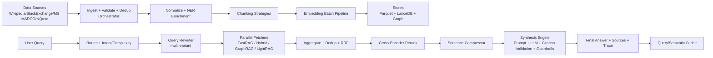

# RAG Layout and Project Review

This document summarizes the current RAG architecture in the `lexbridge-ai` project, focusing on:

- Current Brain/Data module layout
- End-to-end flow diagram
- Why synthesis and language encoder stages are slow
- Technical review of strengths and drawbacks
- Data limitations in the current setup

---

## 1) Current RAG Layout

The system is split into two major layers:

- **Offline indexing pipeline (`data_module`)**
  - Ingest source datasets
  - Validate and deduplicate
  - Normalize and enrich text
  - Chunk and embed
  - Store in Parquet + LanceDB (+ graph store)

- **Online query pipeline (`brain_module`)**
  - Route query by intent/complexity
  - Rewrite query into variants
  - Run parallel retrieval across fetchers
  - Aggregate + rerank results
  - Compress context
  - Synthesize answer with citations and guardrails
  - Return response (with cache/tracing support)

---

## 2) Architecture Diagram

---

## 3) Stage-by-Stage Project Layout

### 3.1 Ingestion and preprocessing (`data_module`)

- Orchestrator: `data_module/data_module/pipelines/orchestrator.py`
  - `Orchestrator.run()` wires ingest -> validate -> normalize -> enrich -> store
- Source loading:
  - `data_module/data_module/pipelines/ingest/loader.py`
  - `data_module/data_module/sources/__init__.py`
- Validator/dedup:
  - `data_module/data_module/pipelines/ingest/validator.py`

### 3.2 Chunking and indexing

- Chunking engine:
  - `data_module/data_module/pipelines/chunk/chunker.py`
- Chunk strategies:
  - `data_module/data_module/pipelines/chunk/strategies.py`
- Storage targets:
  - Parquet: `data_module/data_module/storage/parquet_store.py`
  - LanceDB: `data_module/data_module/storage/lance_store.py`
  - Graph builder via orchestrator

### 3.3 Language encoder / embeddings

- Embedder factory/models:
  - `data_module/data_module/pipelines/embed/embedder.py`
- Batch embedding:
  - `data_module/data_module/pipelines/embed/batch.py`
- Default config:
  - `data_module/config/pipeline.yaml`
  - `embedding_model: sentence-transformers/all-MiniLM-L6-v2`
  - `embedding_device: cpu`

### 3.4 Retrieval

- Dense retrieval:
  - `data_module/data_module/fetch/fast_rag.py`
- Hybrid retrieval:
  - `data_module/data_module/fetch/hybrid.py`
- Graph retrieval:
  - `data_module/data_module/fetch/graph_rag.py`
- Parallel fetch orchestration:
  - `brain_module/brain_module/retrieval/parallel_runner.py`
- Aggregation / fusion:
  - `brain_module/brain_module/aggregation/__init__.py`
  - `brain_module/brain_module/aggregation/rrf_merger.py`

### 3.5 Synthesis

- Synthesis engine:
  - `brain_module/brain_module/synthesis/__init__.py`
- Prompt builder:
  - `brain_module/brain_module/synthesis/prompt_builder.py`
- LLM client abstraction:
  - `brain_module/brain_module/synthesis/llm_client.py`
- Context compression:
  - `brain_module/brain_module/compression/sentence_compressor.py`

### 3.6 Entry points and orchestration

- Main API:
  - `brain_module/brain_module/api/main.py`
- Data pipeline script:
  - `data_module/data_module/scripts/run_pipeline.py`
- Index build script:
  - `data_module/data_module/scripts/build_index.py`
- Source download script:
  - `data_module/data_module/scripts/download_sources.py`

---

## 4) Why Synthesis Is Taking Too Long

Your observation is correct. The current architecture naturally makes synthesis one of the largest contributors to latency:

- Synthesis in `_run_pipeline()` includes full LLM generation call
- Output quality/guardrail constraints add extra logic around generation
- Larger retrieved context (before/after compression) increases prompt size
- If local CPU inference is used (for certain backends), token generation slows dramatically

In practical terms, synthesis latency tends to dominate when:

- Query complexity routes to larger model
- Retrieval returns many long chunks
- Reranker and compressor pass many candidates to synthesis

---

## 5) Why Language Encoder Is Also Slow

The language encoder work appears in multiple places and can stack up:

- Query rewrite creates multiple variants
  - Each variant triggers retrieval calls and embedding work
- Dense retrieval embeds each query variant
- Context compressor re-embeds:
  - Query text
  - All candidate sentences across top chunks
- Optional semantic cache paths may also embed on lookup/set flows

This is especially costly because defaults are currently CPU-oriented (`embedding_device: cpu`), and sentence-level compression can produce many embedding operations per request.

---

## 6) Technical Review: Strengths and Drawbacks

### Strengths

- Good modular design:
  - Clear separation of offline indexing and online reasoning
- Multiple retrieval modes:
  - Dense, hybrid, graph, and LightRAG integration
- Strong serving features:
  - Routing, reranking, compression, guardrails, citation validation, tracing
- Practical production controls:
  - Caching layers, environment-driven toggles, graceful fetcher degradation

### Drawbacks

- Latency stacking:
  - Rewrite + multi-fetch + rerank + compression + synthesis can over-accumulate delay
- CPU-heavy defaults:
  - Encoder and reranker paths become bottlenecks under load
- Startup cost:
  - Hybrid BM25 index build from Parquet can add cold-start overhead
- Memory pressure in ingestion:
  - Some paths materialize full lists before writing, limiting scalability
- Tuning complexity:
  - Many env knobs create fragile performance if not carefully profiled

---

## 7) Data Limitations and Constraints

### 7.1 Coverage limits by configuration

Current source configs intentionally cap rows:

- `wikipedia.yaml`: `max_rows: 100000`
- `ms_marco.yaml`: `max_rows: 100000`
- `natural_questions.yaml`: `max_rows: 50000`

This keeps storage manageable but limits recall and long-tail coverage.

### 7.2 Freshness limitations

- Wikipedia config uses a fixed snapshot (`20231101.en`)
- Other datasets are effectively version-pinned
- Knowledge drift is expected as real-world facts evolve

### 7.3 Language and distribution skew

- Most core retrieval corpus remains English-centric
- `openassistant.yaml` supports multiple languages, but this does not fully offset overall EN dominance

### 7.4 Quality and label limitations

- Quality filters are mostly heuristic (min lengths, thresholds)
- Unified corpus lacks strong universal relevance labels for all domains
- Potential mismatch between benchmark datasets and production query patterns

### 7.5 Licensing constraints

Sources span mixed licenses (CC-BY-SA, CC-BY, Apache, etc.), which can impose:

- Attribution requirements
- Redistribution constraints
- Commercial-use review obligations depending on the combined dataset usage

---

## 8) Direct Note on Current Bottlenecks

Based on the current flow, the two most visible runtime bottlenecks are:

1. **Synthesis step (LLM generation and post-processing)**
2. **Language encoder-heavy paths (query variants + compression embeddings)**

Both are structurally expected in the current architecture and should be addressed with targeted latency optimization if low response times are a hard requirement.

